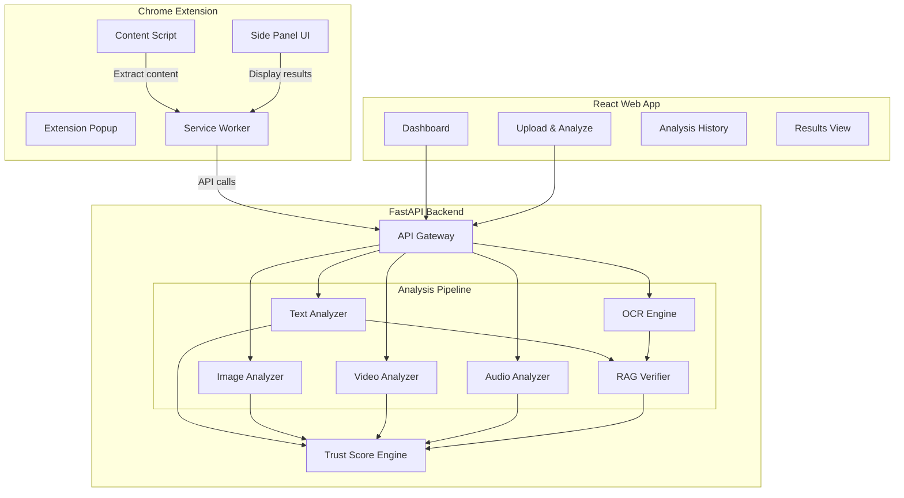

# TruthLens AI — "See through the lies."

TruthLens AI is a **Multimodal Content Verification System** designed to detect deepfakes, AI-generated content, fake messages, and cloned voices. It provides a unified pipeline that analyzes text, images, videos, and audio to determine authenticity and explain the reasoning behind its assessment.

The system is built as a complete ecosystem consisting of three main components:
1. **FastAPI Backend (Python)** - The core AI analysis pipeline.
2. **React Web App (Vite)** - A stunning, dark-mode dashboard for uploading and analyzing media.
3. **Chrome Extension (Manifest V3)** - A browser-integrated tool for verifying content directly on web pages via context menus, popups, and side panels.

---

## 🌟 Key Features

*   **Multimodal Analysis**: Supports text, images, video, and audio in a single unified API.
*   **Deepfake Detection**: Frame-by-frame analysis of videos to detect facial anomalies, temporal inconsistencies, and AI manipulation patterns.
*   **AI Content Identification**: Detects AI-generated text, synthetic voices, and AI-generated images using byte-level heuristics and pattern matching.
*   **Scam & Phishing Detection**: Flags urgent language, suspicious links, and common fraud patterns in text.
*   **RAG-Backed Claim Verification**: Extracts factual claims and verifies them against a built-in knowledge base.
*   **OCR Support**: Extracts text from images and screenshots for analysis.
*   **Explainable AI**: Doesn't just give a label; provides a detailed trust score (0-100%), risk level, and a human-readable explanation of exactly *why* content was flagged.
*   **Beautiful UI**: Premium glassmorphism design with micro-animations and a responsive bento-grid layout.

---

## 🏗️ Architecture



---

## 🚀 Getting Started

### Prerequisites

*   Python 3.9+
*   Node.js 18+
*   Tesseract OCR (optional, for advanced OCR capabilities)

### 1. Setup the Backend (FastAPI)

The backend handles all the heavy lifting for media analysis.

```bash
cd backend

# Create a virtual environment (optional but recommended)
python -m venv venv
source venv/bin/activate  # On Windows: venv\Scripts\activate

# Install dependencies
pip install -r requirements.txt

# Run the server
python main.py
# Or run with uvicorn directly:
# uvicorn main:app --host 0.0.0.0 --port 8000 --reload
```
The API will be available at `http://localhost:8000`. You can view the Swagger documentation at `http://localhost:8000/docs`.

### 2. Setup the Web App (React/Vite)

The web app is the primary dashboard for users to upload files and view detailed results.

```bash
cd webapp

# Install dependencies
npm install

# Run the development server
npm run dev
```
The web app will be available at `http://localhost:5173`.

### 3. Setup the Chrome Extension

The extension allows users to analyze content anywhere on the web.

1. Open Google Chrome and navigate to `chrome://extensions/`.
2. Enable **"Developer mode"** in the top right corner.
3. Click **"Load unpacked"**.
4. Select the `extension` folder inside this project directory.
5. The TruthLens AI extension is now installed! You can access it via the extension popup, side panel, or right-click context menu.

---

## 🛠️ Tech Stack Details

### Backend
*   **Framework**: FastAPI
*   **Media Processing**: OpenCV (video), librosa (audio), Pillow (images)
*   **OCR**: pytesseract
*   **Architecture**: Modular analyzer pattern (Strategy pattern) with a centralized Trust Score Engine.
*   *Note: Currently uses advanced heuristics for demonstration. Real model weights (e.g., EfficientNet, Wav2Vec2) can be integrated into the analyzer modules.*

### Web App
*   **Framework**: React 18 + Vite
*   **Styling**: Vanilla CSS with modern practices (CSS Variables, Flexbox/Grid, Glassmorphism).
*   **Icons**: Lucide React / Phosphor Icons (recommended).

### Chrome Extension
*   **Standard**: Manifest V3
*   **Features**: `sidePanel` API, Service Workers, Content Scripts, Context Menus.

---

## 📊 Analysis Pipeline

1.  **Ingestion**: Media is uploaded via API endpoints (`/api/analyze/text`, `/api/analyze/video`, etc.).
2.  **Modality-Specific Analysis**:
    *   **Text**: Scans for AI phrasing, phishing patterns, and extracts claims.
    *   **Image**: Analyzes byte distribution, metadata, resolution patterns, and extracts text via OCR.
    *   **Video**: Samples frames, detects temporal anomalies, checks compression artifacts.
    *   **Audio**: Analyzes spectral smoothness, splice gaps, and tool signatures.
3.  **Claim Verification**: Extracted text/claims are cross-referenced with a known truth base (RAG).
4.  **Trust Scoring**: The `TrustScoreEngine` aggregates all findings, applies category weights, and calculates a final 0-100% score.
5.  **Explanation Generation**: A human-readable summary and detailed breakdown are generated.

---

## ⚠️ Disclaimer

This system is currently designed as a robust demonstration of a multimodal verification pipeline. The underlying AI detectors use advanced heuristics and simulated scoring based on file hashes to mimic deterministic AI behavior. For production use, the analyzer classes in the backend should be updated to load actual pre-trained PyTorch or TensorFlow model weights.
